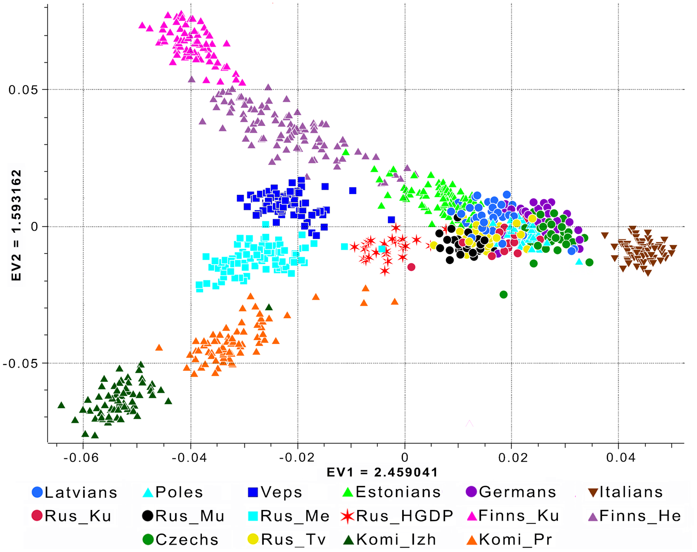

# Prétraitements des données {#preprop}

Pour faire de la modélisation prédictive, il est généralement inévitable de faire des prétraitements aux données pour exploiter autant que possible les différents algorithmes d'apprentissage. Ces prétraitements permettront de réaliser 2 choses:

1. Transformer les données dans un format compatible pour l'algorithme
2. Transformer les données de manière à faciliter l'apprentissage

À ce stade-ci, nous avons acquis une certaine connaissance de ces données grâce à l'analyse de données \@ref(exploration). Dans cette section, nous serons donc en mesure de produire des données propices à l'apprentissage qui sera faite dans la section \@ref(metho). Pour se faire, nous allons couvrir certains concepts théoriques derrière le nettoyage, la réduction et la transformation de données. Ensuite, nous allons voir comment appliquer ces concepts théoriques dans le processus de modélisation en tirant profit du langage R et de certains packages.

## Nettoyage de données

La première étape du prétraitement de données consiste à nettoyer les données. Après cette étape, l'algorithme devrait au minimum être en mesure de fonctionner. Le nettoyage de données comprend plusieurs traitements propres à chaque jeu de données, voici ceux que nous avons identifiés et qui sont assez générales en pratique : 

1. Imputation de données manquantes
2. Traitement des données aberrantes
3. Encodage des données catégoriques

### Imputation de données manquantes

La majorité des jeux de données réels sont témoins de données manquantes. Certains algorithmes ne sont pas en mesure de gérer les données manquantes par eux-mêmes. Cela nous oblige donc à traiter celles-ci et imputer le jeu de données. Les causes d'absence de données peuvent être relativement variées: bris de système, abstention, perte de données, etc. Il est généralement difficile de connaître la raison exacte, ce qui rend le traitement de données manquantes une étape importante. Avant même de trouver une méthode pour imputer ces données manquantes, il faut d'abord évaluer la quantité de données manquantes et tenter de comprendre le mécanisme expliquant la non-réponse d'une donnée.

Il existe essentiellement 3 types de mécanismes de non-réponse [@charest:imputation:2018]:

1. Données manquantes complètement au hasard (MCAR)
2. Données manquantes au hasard (MAR)
3. Données manquantes pas au hasard (NMAR)

Dans le premier cas (MCAR), l'absence de donnée ne dépend pas de la vraie donnée. Par exemple, un système est défaillant dans la collecte de données et arrête de fonctionner en moyenne 5% du temps, et ce, de manière complètement aléatoire.

Dans le deuxième cas (MAR), l'absence de donnée dépend uniquement de la valeur des variables qui ont été observées. Par exemple, des données ont été récoltées à partir de 2 systèmes différents et il est toujours connu de quel système les données proviennent. Pour un des deux systèmes, les données ont une plus grande probabilité d'être manquante.

Dans le troisième cas (NMAR), l'absence de donnée dépend également des données manquantes. La probabilité de non-réponse peut dépendre de la variable elle-même ou d'une autre variable. Par exemple, c'est le cas si les personnes ayant un salaire faible ont une probabilité plus faible de répondre à la question d'un sondage en lien avec le salaire gagné.

Il existe différentes manières d'émettre une hypothèse quant au mécanisme de non-réponse. Certains tests [^tests] statistiques existent pour identifier un cas de MCAR. Cependant, il est difficile de différencier statistiquement MAR et NMAR. Pour se faire, on peut entres autres analyser le comportement des autres variables en fonction de l'absence ou la présence d'une donnée. Une connaissance du domaine d'affaire peut également être utile pour évaluer le mécanisme de non-réponse. Par la suite, il est possible de faire l'imputation selon différentes méthodes:

[^tests]: Voir le test de Welch et le test de Little. Les deux tests ne peuvent garantir l'hypothèse de MCAR. 

1. **Analyse des cas complets**: Conserver uniquement les observations pour lesquelles toutes les variables sont présentes. Cette méthode est très simple, mais nécessite MCAR, sinon peut introduire un biais notable dans les estimateurs.
2. **Imputation par une mesure de centralité**: Utiliser la moyenne, la médiane ou le mode pour remplacer les données manquantes. Cette méthode est relativement simple, mais peu recommandée pour des variables ayant un pourcentage élevé de données manquantes (même pour MCAR). Cela diminue la variabilité et la corrélation entre les variables.
3. **Imputation par régression**: Remplacer les données manquantes par la prévision de modèle de régression entraîné sur les observations pour lesquelles cette variable est présente. On sur-estimera la corrélation entre les variables et diminuera la variance des variables (moins que par l'imputation par mesure de centralité).
4. **Imputation par régression stochastique**: Même chose que la méthode par régression, mais on ajoute un résidu aléatoire à la prévision. Cela permet d'augmenter la variance.

En bref, il est important d'avoir une bonne compréhension des données manquantes dans le jeu de donnée. Cela nous permet de prendre des décisions éclairées sur les techniques utilisées pour imputer ces valeurs manquantes. 

### Traitement des données aberrantes

Une autre étape classique du nettoyage de données consiste à faire le traitement des données aberrantes. Ces données peuvent parfois avoir des effets importants sur l'estimation des paramètres du modèle. La première étape est d'abord d'identifier ces données et d'ensuite les traiter. Voici quelques méthodes traditionnelles pour faire la détection de celles-ci à l'intérieur d'une distribution quelconque:

1. $\pm$ 3 écarts-types de la moyenne
2. $\pm$ 1.5 EI (écarts interquartile)
3. Partitionnement (*clustering*)

Une fois que les observations aberrantes ont été identifiées, il faut par la suite les traiter. Un expert du domaine peut être utile dans ce cas-ci pour analyser ces observations et confirmer leur validité. Si la validité d'une donnée est remise en question, il est coutume de retirer ces observations du jeu de données, car cela peut avoir un impact notoire sur le modèle. Il est important de bien documenter le retrait de ces observations.

### Encodage des données catégoriques {#encodage}

Plusieurs algorithmes d'apprentissage ne peuvent pas traiter des données catégoriques directement. Il faut donc généralement encoder ces attributs en variables numériques pour pouvoir les utiliser dans le modèle. Pour se faire, il faut d'abord faire la distinction entre une donnée de nominale et une donnée ordinale. Dans le premier cas, il n'y a pas vraiment de notion d'ordre entre les différentes catégories. Dans le deuxième cas, on peut ordonner les catégories d'une certaine manière.

Voici un exemple de donnée ordinale (`condition_generale`) où il est possible d'ordonner les observations:

```{r, echo = FALSE}
data.table(Id = seq(1, 4), condition_station = c('moyen', 'mauvais', 'excellent', 'bon'))
```

À l'inverse, voici un exemple où il est moins adéquat d'ordonner les observations selon la variable `quartier`:

```{r, echo = FALSE}
data.table(Id = seq(1, 4), start_quartier = c('Ville-Marie', 'Verdun', 'Westmount', 'LaSalle'))
```

Dans le cas d'une variable ordinale, une méthode d'encodage possible et adéquate (selon le contexte) serait d'assigner une valeur numérique pour chaque catégorie:

```{r, echo = FALSE}
data.table(Id = seq(1, 4), condition_station = c(1, 0, 3, 2))
```

Dans l'exemple ci-dessus, il faut être **prudent**, car en encodant la variable de cette manière, on spécifie au modèle que la distance entre `'mauvais'` et `'moyen'` est la même qu'entre `'bon'` et `'excellent'`. Cette hypothèse n'est pas toujours valide selon le contexte. Les avantages avec cette méthode sont qu'elle est relativement simple, intuitive et qu'elle n'augmente pas le nombre de variables.

Dans le cas d'une variable nominale, il faut généralement opter pour une autre stratégie. Une méthode classique d'encodage dans ce cas-ci est d'utiliser la méthode *un-chaud*[^onehot] (*one-hot encoding*). Cette méthode consiste à traiter chaque catégorie comme une variable indicatrice qui indique la présence de la catégorie:

[^onehot]: Traduction libre, crédit à [Jean-Thomas Baillargeon](https://github.com/jtbai).

```{r, echo = FALSE}
data.table(Id = seq(1, 4), quartier_centre.ville = c(1, 0, 0, 0), quartier_plateau.mont.royal = c(0, 1, 0, 0), quartier_verdun = c(0, 0, 1, 0), quartier_rosemont = c(0, 0, 0, 1))
```

Le principal inconvénient avec la méthode d'encodage *un-chaud* est qu'elle augmente le nombre de variables. Cela peut être significatif pour une variable ayant plusieurs catégories différentes. C'est d'ailleurs dans ce genre de situations qu'il peut devenir intéressant de regrouper certaines classes entres elles, ce que nous allons voir à la section \@ref(transformations).

Il existe d'autres méthode comme l'encodage binaire ou le *hasing*, mais les deux méthodes présentés plus en détails sont généralement les méthodes les plus utilisées en pratique.


## Réduction de données

À la section \@ref(encodage), nous avons vu que certaines méthodes d'encodages peuvent augmenter le nombres de variables. Dans le même ordre d'idées, certains domaines (par exemple la génétique) sont propices à avoir beaucoup d'attributs et ainsi complexifier l'espace de données. Lorsque cela survient, les algorithmes d'apprentissage peuvent souffrir d'un phénomène appelé le fléau de la dimensionnalité. Cela survient lorsque le nombre de dimensions est trop grand, ce qui crée une "distance" plus importante entre les certaines données et rend plus difficile la tâche d'apprentissage. Pour illustrer ce concept, considérons l'exemple suivant:

On suppose qu'on a un jeu de données avec $p=1$ attribut de $n$ observations où $x_1,...,x_n \stackrel{iid}{\sim} U(0,1)$. Combien d'observations en moyenne se trouveront dans l'intervalle $[0;0.1]$? 

La réponse : $\frac{n}{10}$ observations.

Maintenant, supposons que notre jeu de données est plus complexe et possède $p=10$ attributs au lieu d'un seul attribut. Les observations suivent toujours une loi uniforme où $x_1,...,x_n \stackrel{iid}{\sim} U([0,1]^{10})$. Combien d'observations en moyenne se trouveront dans l'intervalle $[0;0.1]^{10}$?

La réponse : $n(\frac{1}{10})^{10}$ observations. 

En d'autres mots, cet exemple [@charest:acp:2018] permet d'illustrer le fait que plus la complexité de l'espace des données est importante, plus on doit couvrir un étendu important pour capturer la même proportion d'observations.

### Analyse en composantes principales

Une méthode traditionnelle et utilisée en pratique pour réduire la dimensionnalité est l'analyse en composantes principales [@hotelling:1933]. C'est une méthode non-supervisée (n'utilise pas la variable réponse) qui permet d'obtenir une représentation à plus petites dimensions d'un jeu de données tout en conservant le maximum d'information possible.

En termes plus simple, on cherche à trouver une combinaison linéaire des $p$ attributs qui permettra de maximiser la variance (information). Cette combinaison linéaire constituera notre première composante principale. Par la suite, on cherche une deuxième combinaison linéaire, qui aura comme contrainte d'être orthogonale à la première, qui maximise encore une fois la variance. On procède de cette manière jusqu'à temps qu'on juge avoir un nombre de composantes principales qui contiennent suffisamment d'information et réduisent la dimensionnalité du jeu de données. À la figure \@ref(fig:acp) [@10.1371/journal.pone.0058552], on peut voir un exemple où avec seulement les 2 premières composantes principales, il est possible de reconstruire les données de manière intéressante avec 166 000 attributs génétiques différents. 

```{r acp, echo=FALSE, fig.align='center', fig.cap="Exemple où l'analyse en composantes principales permet de passer d'une dimension de 166 000  attributs vers une dimension de 2 attributs. On peut également voir que ce genre de méthode permet de rendre possible la visualisation de données à haute dimension."}

```

Voici quelques notes importantes à considérer lorsqu'on utilise cette méthode:

1. Il est important de normaliser (voir section \@ref(normalisation)) les données au préalable. Dans le cas contraire, certaines variables ayant des échelles importantes pourraient avoir l’impression d'apporter beaucoup de variance.
2. L'analyse en composantes principales permet de représenter les données dans une toute autre dimension (on l'espère plus petite), ce qui vient rendre difficile l'interprétation des données dans cette nouvelle dimension. Il peut donc être important de re-transformer les données dans leur format original à la fin.
3. Il n'y a pas de méthode statistique pour choisir le bon nombre de composantes principales. On peut se baser sur le pourcentage de variance expliquée ou tout simplement considérer la transformation comme un hyperparamètre du modèle est conserver le nombre de composantes qui donne les meilleures performances.
4. Pour plus d'informations sur le développement mathématique de la méthode, vous pouvez vous référer au chapitre 10.2 du livre [@James:2014:ISL:2517747].

### Autres méthodes de réduction

Il existe d'autres méthodes pour réduire la dimensionnalité d'un jeu de données lorsque celle-ci cause un problème lors de l'apprentissage. Voici quelques exemples fréquemment utilisées en pratique:

1. Positionnement multidimensionnel: Trouver une représentation (avec une dimension inférieure à la dimension initiale) qui représente le mieux possible les distances entre les observations du jeu de données initial. Voir cette [page web](http://www.statsoft.com/textbook/multidimensional-scaling) pour plus de détails.
2. Analyse factorielle: Réduire la dimensionnalité en modélisant la structure expliquant la relation entre les variables du jeu de données. Voir cette [page web](http://www.statsoft.com/Textbook/Principal-Components-Factor-Analysis) pour plus de détails.
3. Calcul de scores: On peut également réduire la dimensionnalité d'un jeu de données en combinant plusieurs attributs de base pour calculer un nouvel attribut (voir section \@ref(scores)) comme un score par exemple. Cela peut également permettre d'augmenter le pouvoir prédictif d'attributs éparses qui sont difficiles à tirer de l'information lorsque prit individuellement.

## Transformation de données {#transformations}

Avant de passer à l'entraînement d'un modèle, il est préférable pour la majorité des algorithmes d'utiliser les connaissances acquises lors de l’exploration de données (section \@ref(exploration)) pour transformer les données dans un format plus propice à l'apprentissage. Cette étape de transformation est souvent ce qu'on appelle le *features engineering*. Cette étape demande d'ailleurs beaucoup de va et vient avec la prochaine section \@ref(metho).

### Normalisation {#normalisation}

La normalisation des données permet de ramener les données autour d'une distribution plus "standard". Pour certains types de modèles, en particulier ceux qui sont fondés sur des calculs de distance comme les $k$-PPV ou le *clustering*, il est primordial de normaliser les données avant d'en faire l'apprentissage. En effet, cela permet de standardiser les distributions des différents attributs du jeu de données. Par exemple, si j'ai deux variables étant distribuées sur des domaines ayant des échelles complètement différents comme à la figure XX (la température (°C) et une indicatrice indiquant la présence de précipitations), il est préférable de plutôt comparer celles-ci sur un échelle commune comme à la figure YY. Voilà l'objectif fondamental de la normalisation.

Il existe différentes méthodes de normalisation. Il n'y a pas de "bonne méthode", mais certaines sont mieux adaptées à des contextes en particulier. Voici quelques exemples de méthodes traditionnelles où $x_{A}^{\prime(i)}$ représente la donnée $i$ normalisée pour l'attribut $A$ et $x_{A}^{(i)}$ représente la donnée originale.

1. Normalisation centrée-réduite

$$
x_{A}^{\prime(i)}=\frac{x_{A}^{(i)}-\bar{A}}{\sigma_A}
$$

où $\bar{A}$ est la moyenne et $\sigma_A$ la variance de l'attribut $A$.

2. Normalisation *min-max*

$$
x_{A}^{\prime(i)}=\frac{x_{A}^{(i)}-min_A}{max_A-min_A}\big(new\_max_A-new\_min_A\big)+new\_min_A
$$
où le $min_A$ et le $max_A$ sont calculés sur la distribution de l'attribut $A$ alors que $new\_max_A$ et $new\_min_A$ correspondent au nouvel intervalle désiré. 

3. Normalisation pas décimation

$$
x_{A}^{\prime(i)}=\frac{x_{A}^{(i)}}{10^j}
$$
où $j$ est la plus petite valeur entière où $max(|x_{A}^{(i)}|)<1$.

### Discrétisation

La discrétisation consiste à prendre une donnée numérique $A$ et de la transformer en un ensemble de valeurs discrètes qu'on appelle souvent *buckets* ou *bins*. L'idée derrière ce genre de transformation est de simplifier la vie du modèle en lui "pré-mâchant" une donnée continue en certains groupes de valeurs plus faciles à apprendre.

Prenons l'exemple où on utilise la variable température directement pour prédire la durée du trajet. La figure XX montre les distributions de cette variable pour les membres et les non-membres.

À la figure YY, nous analysons encore une fois la variable température, mais cette fois en regroupant les données dans différents groupes basés sur la valeur de la température.

Dans la figure YY, on remarque qu'il semble est intuitivement plus facile de réaliser que ...

Il existe encore une fois plusieurs méthodes pour construire ces regroupements de valeurs. L'étape de l'exploration des données permet entres autres de bien comprendre celles-ci et de créer des groupes qui ajoutent une valeur au modèle. La présence d'un expert du domaine peut également être utile dans ce cas-ci.


### Création de nouveaux attributs {#scores}

Un autre type de transformation classique en modélisation consiste à créer de nouveaux attributs en utilisant les attributs originaux. Ces nouveaux attributs peuvent prendre la forme de scores ou tout simplement être une redéfinition d'un attribut en particulier.

C'est d'ailleurs le genre de transformation qui demande une certaine compréhension des données et de l'algorithme utilisé pour faire l'apprentissage. Par exemple, si on prend la date de départ d'un trajet, il est difficile d'intégrer directement cette variable dans un modèle prédictif. Toutefois, on peut utiliser cette variable pour créer un attribut qui indique si le moment de départ du trajet est un jour de semaine ou un jour de week-end. On pourrait également créer un attribut qui indique s'il y a eu des précipitations de pluie pendant la journée au lieu d'utiliser la quantité de pluie (mm) directement.

Ce type de transformation permet d'intégrer de l'ingénierie dans le jeu de données. Cela peut également permettre de réduire la dimensionnalité lorsqu'un nouvel attribut contient plusieurs autres attributs et que ceux-ci peuvent être retirés du jeu de données. Ultimement, toutes ces transformations de données ont pour objectif de faciliter l'apprentissage et ainsi obtenir un modèle ayant un plus grand pouvoir prédictif.

Les méthodes de transformation de données présentées dans cette section ont comme objectif de faciliter l'apprentissage. Cependant, étant donné que les données sont désormais transformées, il faut faire attention à l'interprétation des résultats. En effet, certaines transformations comme la normalisation ou le lissage font en sorte que les données ne sont plus dans leur format original.

## Prétraitements de données en R

Dans cette section, nous verrons comment appliquer les concepts théoriques décrits dans la section précédente dans un contexte de production. Dans cette optique, il faudra garder une trace des prétraitements effectués sur le jeu de données d'entraînement pour être en mesure de les effectuer de la même manière lors de l'inférence.

Pour se faire, nous proposons de faire 2 processus de prétraitements différents. Le premier servira à faire le prétraitement des données d'entraînement alors que le deuxième servira à faire le prétraitement des données à prédire lors de l'inférence. Les prochaines sections permettront de formaliser les différentes étapes clés à prévoir pour ces deux scénarios différents en tirant profit de certains packages R.

### Séparation du jeu de données

Avant même d'effectuer les premiers prétraitements, il est primordial de garder en tête que nous cherchons à construire un modèle prédictif qui sera performant en généralisation. Pour se faire, il faut inévitablement garder de côté un jeu de données test que nous utiliserons à la toute fin pour avoir une idée plausible de la performance de notre modèle sur des données que celui-ci n'a jamais encore vues. Afin de ne pas induire de l'information de ce jeu de données dans notre entraînement, nous devrons d'abord effectuer cette séparation et ensuite faire les différents prétraitements sur le jeu de données d'entraînement seulement. À la toute fin, nous pourrons effectuer ces mêmes prétraitements sur le jeu de données test et ainsi simuler l'entrée de nouvelles données.

Pour faire la séparation, il courant dans la pratique de prendre un pourcentage arbitraire des données, par exemple 10%, sélectionné aléatoirement pour le jeu de données test. Pour faire cela, il est possible d'utiliser des fonctions de base en R, comme la fonction `sample`:

```{r, echo=TRUE}
ind_train <- sample(x = 1:nrow(data_bixi), size = 0.9 * nrow(data_bixi), replace = FALSE)
head(sort(ind_train), 10)
lapply(list(data_bixi[ind_train,]$duration_sec, data_bixi[-ind_train,]$duration_sec), mean)
```

Dans certaines situations, il peut être utile de faire une séparation qui permet de s'assurer de la présence de certaines données dans chaque jeu de données. Pour faire ce genre de séparation, il est possible de faire un échantillonnage stratifiée sur certaines variables, ce qui assure la cohérence entre les deux jeux de données vis-à-vis ces variables. Cela peut être notamment utile dans un contexte de données débalancées. Pour faciliter la mise en place de ce genre de séparation, il est possible d'utiliser la fonction `createDataPartition` du package `caret`:

```{r, echo=TRUE}
library(caret)
ind_train <- createDataPartition(y = data_bixi$duration_sec, times = 1, p = 0.9, list = FALSE)
head(sort(ind_train), 10)
lapply(list(data_bixi[ind_train,]$duration_sec, data_bixi[-ind_train,]$duration_sec), mean)
```

### Processus de prétraitements

Une fois que la séparation du jeu de données est faite, on peut désormais effectuer nos prétraitements via 2 processus différents. Un premier processus sera appliqué sur les données d'entraînement et un deuxième processus sera appliqué sur le jeu de données test (ou les données nouvelles données à prédire par notre modèle). La figure \@ref(fig:workflow) illustre bien ces 2 processus et comment ceux-ci sont inter reliés. 

```{r workflow, echo=FALSE, fig.align='center', fig.cap="Processus de prétraitements des données"}
knitr::include_graphics("static-files/preprocessing-workflow.png")
```

Le point clé ici est que certains objets seront calculés et sauvegardés lors du processus de prétraitements effectué sur les données d'entraînement. Ces objets seront par la suite utilisés pour le processus de prétraitements des données de test. Les prochaines sections montrent quelques options disponibles en R pour réaliser certaines étapes de ce prétraitements.

#### Imputations de données manquantes

Pour l'imputation de données manquantes, il est nécessaire d'avoir une liste de variables à imputer avec leur valeur d'imputation respective. Le calcul de la valeur d'imputation se fait sur les données d’entraînement seulement.Il est possible de définir les valeurs d'imputations et de sauvegarder ces valeurs dans un fichier JSON en utilisant le package `jsonlite`:

```{r, eval=FALSE, echo=TRUE}
# Définir les valeurs d'imputation
valeurs_imputations <- list(
  start_station_code = median(data_bixi$start_station_code),
  start_wday = median(data_bixi$start_wday)
)

# Sauvegarder le fichier d'imputations dans un JSON
write(jsonlite::toJSON(valeurs_imputations, pretty = TRUE), "chemin/du/model/valeurs_imputations.json")
```

Dans le prétraitement des données d'inférence, on peut désormais importer ces valeurs d'imputation et remplacer les données manquantes:

```{r, eval=FALSE, echo=TRUE}
# Importer en mémoire les données d'imputation
valeurs_imputations <- jsonlite::fromJSON("chemin/du/model/valeurs_imputations.json")

# Remplacer les données manquantes par leur valeurs d'imputation
for (col in names(valeurs_imputations)) {
    data_inference[is.na(get(col)), (col) := list[[eval(col)]]]
}
```

Les fichiers JSON sont généralement faciles à traiter dans plusieurs logiciels et langages différents. En R, il est également intéressant d'utiliser ce format qui se marie bien avec les listes. C'est donc un format que nous recommandons d'utiliser. Notez que dans cet exemple, l'imputation est faite en sauvegardant une liste de valeurs d'imputation. Par contre, cela pourrait également être fait via un autre objet, comme un modèle, qui viendrait faire l'imputation d'une donnée manquante.

#### Encodage de données catégoriques

Pour être en mesure de répliquer l'encodage de données catégoriques, le principal défi est faire l'encodage *un-chaud*. La fonction `dummyVars` du package `caret` permet de réaliser assez facilement ce genre de transformation:

```{r, eval=FALSE, echo=TRUE}
objet_un_chaud <- dummyVars(" ~ weekend_flag", data = data_bixi)
saveRDS(objet_un_chaud, "chemin/du/model/objet_un_chaud.rds")
```

Lors de l'inférence, on peut importer cet objet en mémoire et transformer les variables pour les données à prédire:

```{r, eval=FALSE, echo=TRUE}
objet_un_chaud <- readRDS("chemin/du/model/objet_un_chaud.rds")
data_inference <- predict(objet_un_chaud, newdata = data_inference)
```

Le package `caret` offre plusieurs fonctionnalités intéressantes dans un contexte de modélisation. La fonction `dummyVars` est assez intuitive à utiliser et offre certaines options comme la possibilité de nommer les variables indicatrices par un séparateur au choix (`sep`), comment gérer les nouvelles catégories (`na.action`), la possibilité d'enlever le niveau de base (`fullRank`), etc.


#### Valeurs de normalisation

Pour ce qui est de la normalisation des attributs, il faut encore une fois garder une trace de ces valeurs pour ainsi normaliser adéquatement les données lors de l'inférence. Un peu comme dans l'imputation, on peut calculer ces valeurs sur le jeu de données d'entraînement. Voici une manière de stocker ces valeurs, en utilisant encore une fois le package `jsonlite`:

```{r, eval=FALSE, echo=TRUE}
variables_a_normaliser <- c("variable_1", "variable_2")
moyennes <- apply(data[, (variables_a_normaliser), with = F], 2, mean)
ecarts_types <- apply(data[, (variables_a_normaliser), with = F], 2, sd)
valeurs_normalisation <- list(
  moyennes = as.list(moyennes),
  ecarts_types = as.list(ecarts_types)
)

# Sauvegarder les valeurs de normalisation
write(jsonlite::toJSON(valeurs_normalisation, pretty = TRUE), "chemin/du/model/valeurs_normalisation.json")
```

Une fois les valeurs calculées, on peut les importer et les appliquer sur les données à inférer:

```{r, eval=FALSE, echo=TRUE}
# Importer en mémoire les valeurs de normalisation
valeurs_normalisation <- jsonlite::fromJSON("chemin/du/model/valeurs_normalisation.json")

# Appliquer la normalisation pour les variables à normaliser
data <- lapply(names(valeurs_normalisation$moyennes), function(x) {
  data[, (x) := (get(x) - valeurs_normalisation$moyennes[[eval(x)]])/valeurs_normalisation$ecarts_types[[eval(x)]]]
})[[2]]
```

#### Création de nouveaux attributs

Pour ce qui est de la création de nouveaux attributs et de la discrétisation, ces prétraitements sont généralement fait en appliquant une transformation directe aux données, par exemple, l'application d'une fonction `log`. Ces transformations peuvent donc être programmées via du code source qui sera appliqué de la même manière pour les données d'entraînement que pour les données de test. Voici un exemple de fonction qui permettrait de créer un nouvel attribut et discrétiser un attribut, et ce, pour les 2 jeux de données:

```{r, eval=FALSE, echo=TRUE}
# Fonction qui crée de nouveaux attributs
creation_attributs <- function(data){
  
  # Nouveaux attributs
  data[, `:=`(start_wday = lubridate::wday(start_date, week_start = 1),
              start_hour = hour(start_date_time))]
  
  # Discrétisation
  data[start_quartier %in% c("outremont", "cotedesneigesnotredamedegrace", "westmount", "lesudouest", "verdun", "lasalle"), start_quartier_group := "sud_ouest"]
  
  data
}

# La fonction s'applique de la même maniere pour les 2 jeux de données
data_train <- creation_attributs(data_train)
data_test <- creation_attributs(data_test)
```

## Conclusion

En conclusion, le prétraitement de données a comme objectif de partir d'une table de données brutes et de rendre cette table compatible et prédictive pour un algorithme d'apprentissage. Pour se faire, il nécessaire de commencer par nettoyer les données. Ensuite, certaines étapes de réduction et de transformations de données permettront de rendre les données plus prédictives pour le modèle. Finalement, il est important de garder en tête que les prétraitements doivent pouvoir être répliqués sur les données à inférer. C'est pourquoi il est primordial de garder une trace de ces prétraitements, et ainsi rendre possible le prétraitement d'une seule et unique requête à prédire.


## Références
