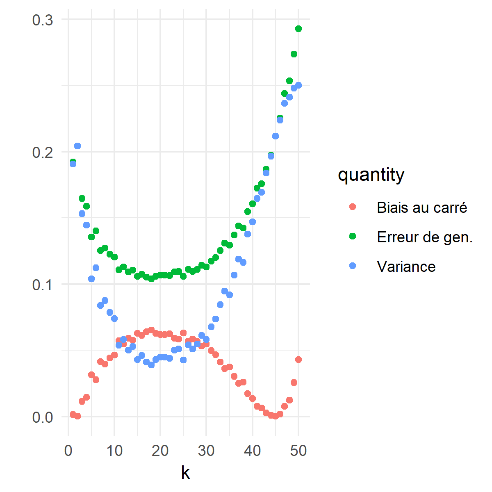

# Construction de modèles {#metho}

```{r, echo = F}
library(data.table)
library(ggplot2)

library(glmnet)
library(xgboost)
library(mvtnorm)

data <- fst::read.fst("data/data_preprocess.fst", as.data.table = T)[1:10000,]
data$moment_journee <- factor(data$moment_journee, labels=c("A","B","C","D"))
```

Une fois les données nettoyées convenablement, la variables réponse et les variables explicatives choisies, nous sommes prêts pour construire le modèle prédictif.
Bien sûr, le choix des variables explicatives restent préliminaires : on peut réaliser, après avoir tenté plusieurs modèles, qu'elles ne sont pas assez informatives pour permettre des prédictions satisfaisantes.
Il faudra alors considérer d'autres options; transformer nos variables, ou en en collecter de nouvelles.

Supposons pour l'instant que notre variable réponse $y$ est quantitative. En introduction du document, nous avons fait l'hypothèse qu'il existe une fonction $f$ connectant nos variables explicatives $\mathbf{x}$ à $y$ de telle sorte que
\begin{equation} 
  \mathbf{y} \approx f(\mathbf{X}). (\#eq:approx)
\end{equation}
L'objectif principal, dans ce chapitre, est d'apprendre (ou plutôt d'approximer) la fonction $f$ à l'aide de la théorie de l'apprentissage statistique. Plusieurs éléments sont tirés des livres *An Introduction to Statistical Learning: with Application in R* de Gareth James, Daniela Witten, Trevor Hastie et Robert Tibshirani; *The Elements of Statistical Learning* de Trevor Hastie, Robert Tibshirani et Jerome H. Friedman; et finalement *R for Data Science* de Hadley Wickham et Garrett Grolemund [REMOVE?]. L'expression *apprentissage statstique* a été grandement popularisée par les auteurs des deux premières références, qui donne la définition (traduction libre)

>> L'apprentissage statistique fait référence à un ensemble d'outils pour modéliser et comprendre des jeux de données complexes. C'est une sous-discipline récente de la statistique qui se développe en parallèle avec les avancées en informatique et, plus particulièrement, en apprentissage automatique. [@James:2014:ISL:2517747]

Nous supposons que le lecteur possède des connaissances de base en statistique (espérance, variance, etc).

Les sujets suivants sont traités : la gestion du jeu de données (entraîenement/validation/test); l'identification de modèles adéquats; l'estimation de modèles (fonction de perte, compromis biais-variance); la sélection et l'évaluation d'un modèle (validation croisée, erreur de généralisation). 


## Gestion des données {#split}

<span style="color:fuchsia">**Concepts clefs : entraînement/validation/test**</span>

Pour plusieurs raisons, il est conseillé, avant même le pré-traitement des données de la Section \@ref(preprop), de séparer aléatoirement son jeu de données en trois partie distinctes : les jeux de données d'entraînement, de validation et de test.
Chacune des trois parties est associées à une étape de la construction du modèle. Les données d'entrainement serviront à estimer différents modèles; les données de validation à sélectionner un modèle; les données de test à évaluer le modèle final.
Lorsque le nombre d'observation le permet, la règle du pouce généralement employée est d'utiliser la moitié des observations pour l'entrainement et le quart pour chacune des deux autres étapes.
$$
  {\Large \left(\mathbf{X}|\mathbf{y}\right)}
  \quad
  =
  \quad
  \left(\begin{array}{ccc|c}
    x_{11} & \dots & x_{1d}  & y_1\\
    x_{21} & \dots & x_{2d}  & y_2\\
    \vdots &  & \vdots & \vdots\\
    x_{n1} & \dots & x_{nd}  & y_n
  \end{array}\right)
  \begin{array}{ccc}
    \Bigg\} & \stackrel{\approx 1/2}{\longrightarrow} & (\mathbf{X}_{\rm train}|\mathbf{y}_{\rm train})\\
    \Big\} & \stackrel{\approx 1/4}{\longrightarrow} & (\mathbf{X}_{\rm val}|\mathbf{y}_{\rm val})\\
    \Big\} & \stackrel{\approx 1/4}{\longrightarrow} & (\mathbf{X}_{\rm test}|\mathbf{y}_{\rm test})
  \end{array}
$$

Il est important de garder en tête que ce n'est qu'une *règle du pouce*.
Si le jeu de données contient peu de signal (d'information) pour prédire $\mathbf{y}$, il se peut qu'en laissant de côté certaines observations, l'estimation des modèles soit trop déficiente pour être utile.
Les étapes des chapitres précédents permettent généralement de se faire une idée de la situation.
Il est aussi conseillé (à moins qu'on veuille prendre avantage d'un effet temporel dans nos données) d'effectuer une permutation aléatoire de nos données, pour éviter que notre division du jeu de données ne soit pollué par des effets indésirables de l'ordre de collecte.

On associe au jeu de données d'entraînement l'*erreur d'entrainement*, qui quantifie la performance de notre modèle sur... les données d'entraînement.
En contrepartie, les jeux de données de validation et de test servent tous deux à estimer l'*erreur de généralisation*, c'est-à-dire l'erreur faite sur de **nouvelles** données.
Cela explique d'ailleurs la confusion entourant ces derniers et leur utilité.
Les données de validation servent à choisir un modèle parmi une panoplie considérés.
À titre d'exemples concrets, ceci permet de choisir le nombre d'intéractions croisées dans un modèle linéaire généralisé ou le nombre de couches cachées dans un réseau de neurones.
On appelle ces derniers, qui dictent la structure du modèle, des *hyper-paramètres*.

**À retenir** : il se peut que les deux types d'erreur soient calculées exactement de la même façon.
Ce qui les différencie, c'est vraiment les données utilisée pour faire le calcul.
Si les données ont été utilisée pour ajuster le modèle, alors l'erreur obtenue sur celles-ci ne sera pas un bon indicateur de l'erreur de généralisation.
C'est pourquoi il est absolument impératif de garder les données de test dans un coffre-fort bien cellé.
Sinon, l'estimation finale de l'*erreur de généralisation* pourrait être induement optimiste et de mauvaises surprises pourraient surgir lors de la mise en production.
Il faut garder en tête que l'objectif est de prédire de **nouvelles** valeurs $y$ à l'aide de **nouvelles** valeurs $\mathbf{x}$; l'*erreur de généralisation* est donc au coeur de nos préoccupations.

Lorsque trop peu de données sont disponibles, l'étape de validation doit souvent être abandonnée et des techniques plus sophistiquées peuvent nous permettre d'estimer l'*erreur de généralisation* à partir des données d'entrainement.
C'est ce que allons faire dans ce chapitre.
Divisons donc notre jeu de données en deux : les données d'entraînement et de test.
```{r, echo=T}
# data_bixi <- data.table::fread("data/data_bixi.csv") # jeu de données original
# ind_test <- sample(nrow(data_bixi),nrow(data)*25/100) # 25% des données assignées au jeu test
# saveRDS(ind_test, "data/models/ind_test.rds") # on garde en mémoire la sélection
#
# source("src/preprocessing/preprocessing.R")
# data <- preprocessing(data_bixi[-ind_test,], path_objects = "data/models/", train = TRUE)
```
Pour automatiser le processus, la fonction `caret::createDataPartition` est une option intéressante.

Encore une fois, notez que **la séparation du jeu de données précède le prétraitement**.
D'ici au moment ou nous nécessiterons le jeu de données test, nous utilisons $\mathbf{X}$ en référence aux données d'entrainement.


## Description d'un modèle {#description}

<span style="color:fuchsia">**Concepts clefs : régression vs. classification**</span>

Commençons d'abord en reformulant l'équation \@ref(eq:approx) en tant qu'égalité stricte.
Pour ce faire, on introduit une quantité aléatoire $\varepsilon$ qui représente la variabilité non captée par notre modèle.
Cela donne l'équation
\begin{equation}
  y = f(\mathbf{x}) + \varepsilon.
  (\#eq:equal)
\end{equation}
Pour une variable réponse $y$ continue, il est naturel de faire les deux hypothèses suivantes à propos de $\varepsilon$:

- son espérance est nulle, c'est-à-dire $\mathbf{E}(\varepsilon) = 0$; et
- elle est indépendante de $\mathbf{x}$.

Ceci nous permet entre autres d'ignorer $\varepsilon$ lorsque vient le temps de faire une prédiction.
Étant donné $\mathbf{x}$, on s'attend à ce qu'en moyenne $y$ soit égale à $f(\mathbf{x})$, *i.e.* $\mathbf{E}(y) = f(\mathbf{x})$.

En introduisant $\varepsilon$, on admet l'existence d'une erreur *irréductible* : même si nous réussissions à estimer $f$ parfaitement, il faudrait s'attendre à ce que nos prédictions ne soient pas nécéssairement parfaites.
Par exemple, même en sachant que nos données sont telles que $y_i = 2x_i + \varepsilon_i$, l'erreur moyenne de prédiction résultante (avec le vrai modèle) sera d'environ $\mathbb{V}{\rm ar}(\varepsilon_1)$.
Générons $n=25$ observations à partir de ce modèle pour visualiser le phénomène.
```{r, echo=FALSE, out.width = "60%",fig.align='center'}
dt <- data.table(x = runif(25), eps = rnorm(25,0,.1))
dt[, y := 2*x + eps]

# g <- ggplot(dt, aes(x=x)) +
#   geom_point(aes(y=y)) +
#   geom_line(aes(y=2*x)) +
#   geom_text(x=.15, y=.4, label="f(x)") +
#   theme_minimal()
#   ggsave("static-files/irreducible.png", g, width = 5, height = 5)
```
<center>
{ width=50% }
</center>


Aucune de nos prédictions (qui se trouvent sur la droite) ne correspond à la vraie valeur $y$ observée.

L'intuition est qu'on admet la présence de facteurs influençant $y$ auxquels nous n'avons pas accès (qui ne sont pas mesurés) ou qui ne sont simplement pas mesurables.
L'utilisation d'un modèle $f$ qui ne permet pas de capturer l'essentiel de la relation entre $\mathbf{x}$ et $y$ peut aussi limiter notre potentiel de réduction de l'erreur.
Ce qui est en notre pouvoir (du moins, si on exclut la re-collecte de données) concerne la fonction $f$.
Il est donc important de choisir une famille de modèles appropriée pour le problème qui nous intéresse.

On divise généralement les problèmes en deux grandes catégories : la régression et la classification.
La régression sous-entend une variable réponse continue, *e.g.* la grandeur d'une individue ; la classification sous-entend une variable réponse catégorique (une classe), *e.g.* chat ou chien.
Avec nos données bixi, nous ferons une régression pour prédire la durée d'un trajet et une classification binaire pour prédire si un utilisateur terminera sa course dans le même arondissement ou non.
La régression, une régression linéaire, sera effectuée avec la librairie `glmnet`(vignette : [glmnet](https://web.stanford.edu/~hastie/glmnet/glmnet_alpha.html)), est intégrée au texte.
La classification est effectuée à l'aide de la librairie `xgboost` (vignette : [XGBoost](https://xgboost.readthedocs.io/en/release_0.72/R-package/xgboostPresentation.html)), qui permet de faire du *boosting* d'arbres de décision; elle est reléguée à la fin du chapitre.

Notez que pour classifier des observations/exemples, on modélise généralement la probabilité qu'une observation appartienne à certaine une classe, ce qui revient en quelque sorte à modéliser une variable réponse continue (une fréquence).
On assigne ensuite l'observation à la classe la plus probable.


## Choix d'un modèle {#choix}

Le choix d'une famille de modèles est intimement lié à la tâche qu'on souhaite résoudre et aux données à disposition.
En se restreignant à une certaine famille, on impose un ensemble de contraintes à la fonction $f$ de l'équation \@ref(eq:equal), ce qui limite le type de relation entre $Y$ et $\mathbf{X}$ qu'il sera possible d'apprendre ; paradoxalement, c'est aussi ce qui permet l'apprentissage.
Par exemple, la (populaire) régression linéaire sous-entend une relation linéaire entre la variable réponse et les facteur explicatifs :
\begin{equation}
  y = \beta_0 + \beta_1 x_1 + \dots + \beta_1 x_d + \varepsilon
  (\#eq:reg)
\end{equation}
Ici, les paramètres $\mathbf{\beta} = (\beta_0,\dots,\beta_d)$ déterminent comment un changement porté aux variables explicatrices influencera la prédiction.
Nous utiliserons ce modèle pour prédire la durée station à station d'un trajet en bixi.

La plupart du temps, les modèles plus contraignants sont favorisés lorsque peu d'observations sont disponibles pour prendre avantage d'une structure dans les données qui est connue (ou supposée) *à priori*.
Certains modèles comme les réseaux de neurones profonds sont reconnus pour être efficaces dans des cas ou la relation entre les variables est très complexe, mais requierent généralement une grande quantité de données.
Certains modèles plus simples, comme la régression linéaire, sont parfois choisient pour leur meilleure interprétabilité.

Pour une variable réponse catégorique (disons $K$ classes), la régression de \@ref(eq:reg) n'est pas conseillée.
On peut toutefois la modifier légèrement pour trouver un modèle de classification très répandu : la régression logistique.
Restons dans le cas binaire pour plus de clarté.
La clef consiste à considérer non pas notre réponse $Y$, mais $y^* = \mathbb{P}[Y = 1 | \mathbf{X}]$, la probabilité que $Y = 1$ conditionellement aux valeurs des variables explicatives $\mathbf{x}$.
Un problème majeur avec la régression en \@ref(eq:reg) est son incapacité à contraindre la réponse entre 0 et 1, l'espace naturel pour une probabilité.
Pour intégrer cette contrainte au modèle, on considère les *log-cotes* (*log-odds*) avec la fonction *logit* (*logistic unit*), ce qui donne
$$
  \mathrm{ln}\left( \frac{y^*}{1-y^*} \right) = \beta_0 + \beta_1 x_1 + \dots + \beta_d x_d + \varepsilon.
$$
Ce modèle est généralisable pour un problème de classification multi-classes.

Même lorsqu'on se limite à une famille de modèle, il reste à déterminer quelles variables nous seront incluses.
Une option simple est de les inclure toutes.
On verra plus tard que ce n'est pas toujours souhaitable, en particulier si certaines d'entre elles ne sont pas pertinentes.
De plus, on peut vouloir considérer des intéractions entre les variables, c'est-à-dire artificiellement ajouter des termes du style $\beta_{*} x_{i} x_{j}$, ce qui fait exploser le nombre de modèles possibles.
Laissons ces considérations de côté pour le moment et concentrons sur l'estimation d'un modèle pour lequel les variables sont choisies et figées.
Nous reviendrons à cette question dans la sous-section \@ref(regularisation)

## Estimation d'un modèle {#estimation}

<span style="color:fuchsia">**Concept clef : fonction de perte**</span>

Estimer un modèle consiste à déterminer la valeur optimale de ses paramètres. 
Ils sont choisis de telle sorte que le modèle soit le plus précis possible dans ses prédictions (sur les données d'entraînement).
On cherche donc à minimiser l'erreur d'entraîenement, qu'on quantifie à l'aide d'une fonction de perte $L(y,\hat{y}) = L(y,f(x))$ qui détermine la pénalité associée à une mauvaise prédiction.
Dans certains cas comme la détection de fraude, où une transaction identifiée comme frauduleuse sera vérifiée par un agent, on peut vouloir minimiser le nombre de faux négatifs (les transactions frauduleuses qui nous glissent entre les doigts), quitte à introduire plus de faux positifs (des transactions identifiées frauduleuses qui ne le sont pas réellement).
En d'autres termes, le choix de $L$ doit s'aligner avec nos attentes par rapport au modèle.

La fonction de perte la plus populaire est sans contredit l'erreur quadratique, $L(y,\hat{y}) = (\hat{y} - y)^2$.
Puisque nous avons à notre disposition plusieurs observations (supposées indépendantes), il s'agit de minimiser la somme des erreurs.
Par exemple, combinée à la régression linéaire, l'erreur quadratique donne
$$
  \boldsymbol{L}(\boldsymbol{y},\boldsymbol{\hat{y}}) = \sum_{i=1}^n (y_i - \hat{y}_i)^2 = \sum_{i=1}^n \Big(y_i - (\beta_0 + \beta_1 x_{i1} + \dots + \beta_1 x_{id})\Big)^2.
$$
En notation matricielle, pour $\mathbf{y} \in \mathbb{R}^n$ et $\mathbf{X} \in \mathbb{R}^{n \times d}$, cela donne (en supposant ici $\beta_0 = 0$)
$$
  \boldsymbol{\hat\beta} = \mathrm{argmin}_{\mathbf{\beta}} \ (\mathbf{y} - \mathbf{X}^\top \boldsymbol{\beta})^{\top}(\mathbf{y} - \mathbf{X}^\top \boldsymbol{\beta}) = (\mathbf{X} \mathbf{X}^\top)^{-1} \mathbf{X} \mathbf{y},
$$
le fameux estimateur des moindres carrées.

Plusieurs librairies R permettent l'ajustement de modèles linéaires généralisés.
La méthode du maximum de vraisemblance, qui coincide avec la méthodes des moindres carrées pour la régression linéaire, est souvent utilisée pour l'estimation des paramètres (voir *e.g.* [@Friedman:2001:ESL] pour plus de détails).
Nous utilisons ici `glmnet` pour modéliser la durée d'un trajet. 
Tout d'abord, définissons une formule.
```{r, echo=T}
cols <- grep("start_q", colnames(data))
colnames(data)[cols] <- paste0("start_quartier_",1:length(cols))

rhs <- paste0(colnames(data)[-c(1,2)], collapse=" + ")
f <- as.formula(paste("target_duree", rhs, sep=" ~ "))
f
```

Contentons-nous pour l'instant d'un modèle sans intéractions (voir sous-section \@ref(regularisation)).
La fonction `model.matrix` permet de créer la matrice $\mathbf{X}$ qu'on doit fournir à la fonction `glmnet`.
```{r, echo=T}
glm00 <- glmnet::glmnet(x = model.matrix(f, data), y = as.matrix(data$target_duree,ncol=1), family = "gaussian", lambda=0) # On reviendra sur alpha et lambda...
```
L'option `family` sert à choisir une distribution pour l'erreur irréductible $\varepsilon$.
Le distribution normale est de loin la plus populaire à ce titre.

Pour une petite idée de la fidélité des prédictions
```{r, echo=T, out.width = "50%",fig.align='center'}
data[,glm00_pred := predict(object = glm00, newx = model.matrix(f, data))]
ggplot(data) +
  geom_density(aes(x=target_duree), fill="green") +
  geom_density(aes(x=glm00_pred), fill="blue", alpha = .5) + theme_minimal()
```
Évidemment, plus de variables explicatives sont nécessaires pour prédire les valeurs extrêmes.
Le modèle fait tout de même des prédictions personnalisées.
```{r, echo=T}
glm00$beta
```

### Un mot sur la régularisation {#regularisation}

<span style="color:fuchsia">**Concepts clefs : pénalités ridge et lasso, sur-apprentissage **</span>

Utilisons maintenant des intéractions entre le moment de la journée et les quartiers de départ (que nous avons encodés dans `cols`).
Pour ce faire, il suffit de coller les nombre des variables qu'on veut faire intéragir avec les deux-points `:` et de les insérer dans notre formule.
```{r, echo=T}
rhs <- paste0(rhs, " + ",
              paste0("moment_journee:", colnames(data)[cols], collapse=" + "))
f <- as.formula(paste("target_duree", rhs, sep=" ~ "))
f
```
Lorsque beaucoup de variables explicatives (ou des fonctions de celles-ci) sont considérées simultanément, il est possible qu'un sous-ensemble d'entre elles ne soit pas pertinent pour la tâche à effectuer.
Plus généralement, lorsqu'un modèle est sur-paramétrisé par rapport à la quantité d'observations disponible, les techniques classiques d'estimation doivent être revues pour éviter le sur-apprentissage (*overfit*).
Le danger est que le modèle apprenne (en quelque sorte par coeur) le jeu de données d'entraînement, ce qui diminue son pouvoir de généralisation.

Les techniques de régularisation permettent de mitiger ces effets négatifs en modulant l'importance de certaines variables pour la prédiction. 
Nous l'expliquons ici dans le contexte de la régression linéaire, mais l'idée est valide ou généralisable pour plusieurs modèles.
L'approche consiste à ajouter une pénalité (appliquée aux paramètres $\boldsymbol{\beta}$) à la fonction de perte $L$, c'est-à-dire
$$
  \sum_{i=1}^n L(y_i,f(\mathbf{x}_i | \boldsymbol\beta )) + \lambda P(\beta), \qquad \lambda \in \mathbb{R}.
$$
Le coefficient $\lambda$ est un *hyper-paramètre* controlant le degré de régularisation que nous souhaitons appliquer.
La plupart du temps (par choix), la fonction $P$ pénalise davantage les vecteurs $\boldsymbol{\beta}$ avec de grandes valeurs.
Encore une fois, la norme euclidienne (carrée) qu'on utilise pour la fonction de perte est très populaire. 
$$
  P(\boldsymbol{\hat\beta}) = ||\boldsymbol{\hat\beta}||_2^2 = \sum_{j=1}^p \hat\beta_j^2.
$$
Sa combinaison avec la régression porte le nom de régression *ridge*. 
On l'utilise pour atténuer l'impact du bruit (la variance introduite par les variables non-pertinentes).
Intuitiviment, si certains coeficients $\beta_j$ sont artificiellement gonflés, alors on devrait obtenir une meilleure erreur de généralization lorsque ces derniers sont réduits.
La librairie `glmnet` permet la régression ridge avec le paramètre `lambda` avec *e.g.*
```
glmnet::glmnet(x = model.matrix(f, data), y = as.matrix(data$target_duree,ncol=1), family = "gaussian", lambda=1)
```
Pour des raisons computationelles (et de convergence), il n'est toutefois pas conseillé de fournir une valeur unique pour `lambda` à la fonction `glmnet`, mais plutôt un ensemble de valeurs pour chacunes desquelles l'algorithme ajustera un modèle.

Une deuxième pénalité très populaire est la somme des valeurs absolues des paramètres (la méthode *lasso*) :
$$
  P(\boldsymbol{\hat\beta}) = \sum_{j=1}^p |\hat\beta_j|.
$$
Son grand avantage est qu'elle force, pour une intensité $\lambda$ assez forte, certains paramètres à zéro exactement (et non pas seulement à être petits).
Dans ce cas, il est ensuite plus facile d'identifier les variables explicatives significatives et d'interpréter le modèle.
La fonction `glmnet` applique cette pénalité par défault avec `alpha = 1`.
En fait, `alpha` permet de pondérer les pénalités *ridge* et *lasso*, et donc d'utiliser les deux à la fois (la technique *elastic net*).
Notez que `lambda` est encore utilisé avec le *lasso*.

D'une certaine façon, la méthode *lasso* généralise donc une autre méthode bien connue pour déterminer les variables à intégrer au modèle : la régression *step-wise* (*forward/backward selection*).
Par exemple, avec la *forward selection*, on intègre une à une les variables en commençant par les plus significatives (selon un test statistique choisi).
La *backward selection* est définie similairement, mais en partant du modèle complet et en éliminant des variables non-significatives.
Finalement, ces dernières peuvent être combinées en une méthode qui, à chaque étape, peut entrer et/ou sortir des variables du modèle.
Comme le nombre de variables incluses dans le modèle n'est pas directement un paramètre du modèle lui-même, on peut le considérer comme un hyper-paramètre, équivalent au $\lambda$ du *lasso*.


### Les hyper-paramètres et le compromis biais-variance

<span style="color:fuchsia">**Concepts clefs : hyper-paramètre, compromis biais-variance (lolk)**</span>

Pour comprendre pourquoi l'inclusion de toutes les variables n'est pas toujours avantageuse, ou plus généralement la pertinence de la régularisation, il faut s'attarder au concept de *compromis biais-variance*.
Dans le cas de la régression linéaire, la fonction $f(\cdot| \boldsymbol{\hat\beta})$ estimée dépend des données par l'entremise de $\boldsymbol{\hat\beta}$, c'est donc dire qu'avec un autre jeu de données (provenant de la même distribution) on obtiendrait un modèle différent.
La variance inhérente au processus d'estimation est une composante importante de l'*erreur de généralisation*.
L'erreur de généralisation au point $\mathbf{x}_0$ est donnée par
\begin{equation}
  \mathbb{E}[(Y - \hat{f}(\mathbf{x}_0))^2 | \mathbf{x}_0] = \mathbb{V}{\rm ar}(\hat{f}(\mathbf{x}_0)) + {\rm Biais}
[\hat{f}(\mathbf{x}_0)]^2 + \mathbb{V}{\rm ar}(\varepsilon).
\end{equation}
Le dernier terme est l'erreur irréductible, sur laquelle (par définition) on n'a pas de contrôle.
Les deux premiers termes sont le biais (au carré) et la variance de l'estimateur $\hat{f}$ de $f$ (*e.g.* l'estimateur $f(\cdot | \hat\beta)$ de $f(\cdot | \beta)$).
L'introduction d'une pénalité augmente le biais : certains paramètres se voient réduits injustement.
Par contre, l'effet sur la variance va dans l'autre sens : les modèles plus pénalisés auront tendance à moins changer lorsqu'entraînés sur de nouvelles données.

Pour illustrer l'idée, considérons des données qui proviennet d'un mélange de deux populations normales avec des moyennes différentes.
```{r, echo=T, out.width = "60%", fig.align='center'}
train_dummy <- data.table(y = sample(0:1, 50, replace = T))
train_dummy[, x1 := rnorm(n=50, mean=y, sd=1/2)]
train_dummy[, x2 := x1 + rnorm(n=50, mean=y, sd=1/4)]
g <- ggplot(train_dummy, aes(x=x1, y=x2, col=factor(y))) + geom_point(size=2) +
  theme_minimal() + labs(col = "classe")
g
```
On peut utiliser ces données pour prédire la classe associée à un nouveau point $x_0$ en fonction des (disons) 3 points $x_j$ dans `data_dummy` les plus près de $x_0$.
```{r, echo=T}
test_dummy <- data.table(y = sample(0:1, 100, replace = T))
test_dummy[, x1 := rnorm(n=100, mean=y, sd=1/2)]
test_dummy[, x2 := x1 + rnorm(n=100, mean=y, sd=1/4)]

new_y_pred <- class::knn(train = matrix(c(train_dummy$x1,train_dummy$x2),ncol=2),
                         test = matrix(c(test_dummy$x1,test_dummy$x2),ncol=2),
                         cl = train_dummy$y, # vraie classes du data d'ent.
                         k = 3) # nombre de voisins utilisé

test_dummy[, pred := new_y_pred]
test_dummy[, succes := new_y_pred == y]

g + geom_point(data = test_dummy, aes(x=x1, y=x2, colour=factor(y), shape = factor(succes, labels = c("non","oui"))), size=2) +
  scale_shape_manual(values=c(4,0)) + 
  theme_minimal() + labs(col = "classe", shape = "bonne prédiction")
```
Dans ce cas, `k` est l'hyper-paramètre.
Comme plusieurs hyper-paramètres, il sert à lisser nos prédictions.
Plus $k$ est grand, plus on aggrège d'information pour faire notre prédiction.
Par exemple lorsque $k = n$, le nombre d'observations dans le jeu d'entraînement, on obtient toujours la même prédiction (la classe avec le plus de représentants, très embettant quand les classes sont de mêmes tailles).
Approximons l'erreur de généralisation pour chaque valeur de $k$ au point $x_0 = .75$.
Notons que $\mathbb{E}[Y|X_1 = .5, X_2 = 1]$ est donné par
```{r, echo=T}
x0 <- c(.75,.75)
Sig <- matrix(1/2^2,2,2) # la matrice de variance-covariance pour la classe 1
Sig[2,2] <- Sig[2,2] + 1/4^2 # la variance de x2
Ex0 <- dmvnorm(x0, mean = c(1,1), sigma = Sig)/(dmvnorm(x0, mean = c(0,0), sigma = Sig) + dmvnorm(x0, mean = c(1,1), sigma = Sig)) # la prob conditionnelle que x0 = 1
```
En générant des données d'entraînement, on peut estimer l'erreur au carré, la variance, et donc l'erreur de généralisation.
Voici ce que ça donne en fonction de $k$ (2000 répétitions pour chaque valeur de $k$).
```{r, visible = F}
# createMseFig()

```
<center>
{ width=50% }
</center>

<span style="color:red">**Particularité des hyper-paramètres :**</span> Les hyper-paramètres comme $\alpha$, $\lambda$ et $k$ ne peuvent être estimés de façon traditionnelle.
On estime un modèle pour chaque valeur de `alpha` et `lambda` préalablement choisies : ce qu'on appelle souvent un *grid search*.
On peut utiliser la fonction `expand.grid` pour créer la grille
```
hp_grid <- expand.grid(alpha = seq(0,1,.01), lambda = seq(0,10,.1))
```
Pour la fonction `glmnet::glmnet`, on peut laisser l'argument `lambda` vide et spécifier `nlambda`, le nombre de valeurs à essayer (la fonction s'occupe du reste).
Par défaut `lambda = NULL` et `nlambda = 100`.
On a donc qu'à s'occuper de `alpha`
```{r, echo=T}
glm_list <- lapply(seq(0,1,.25), function(alpha){
  glmnet::glmnet(x = model.matrix(f, data), y = as.matrix(data$target_duree,ncol=1), family = "gaussian", alpha = alpha)
})
```
Lorsque `alpha` est positif, les modèles associés aux plus fortes valeur de `lambda` feront usage de moins de variables pour expliquer la réponse; à l'opposé, `lambda = 0` produira un modèle les incluant toutes.
En particulier, le modèle *lasso* (`alpha = 1`) avec la plus forte intensité `lambda` utilisera seulement $\beta_0$.

Comme chaque combinaison d'hyper-paramètres produit un modèle, c'est à l'étape de sélection de modèle que leurs valeurs seront déterminées.
En fait, surtout lorsque les hyper-paramètres en question concernent la sélection de variables, la recherche en grille est souvent intégrée à l'étape de sélection de modèle.


## Sélection d'un modèle et son évaluation {#sélection}

<span style="color:fuchsia">**Concepts clefs : erreur de généralisation, validation croisée, matrice de confusion, fonction `predict`**</span>

Une fois que l'on possède plusieurs candidats intéressants, il reste à choisir le modèle final parmi ceux-ci.
Pour rester fidèle à l'objectif ultime, on choisit le modèle avec la plus faible erreur de généralisation.
Voici quelques méthodes qui permettent de trouver ce modèle.

### Validation directe

Si un jeu de données de validation est disponible, c'est maintenant qu'on l'utilise pour calculer l'*erreur de généralization*.
À moins qu'une autre fonction de perte ne se présente comme naturelle pour le problème en question, on calcule l'erreur de généralisation de la même façon que l'erreur sur le jeu d'entraînement, c'est-à-dire avec la fonction $\boldsymbol{L}$.
Pour réduire l'influence des valeurs extrêmes, nous utiliserons -- au lieu de l'erreur quadratique moyenne (*MSE*, $(y - f(x))^2$) -- l'erreur absolue moyenne (*MAE*, $|y - f(x)|$).
Il sera aussi plus facile d'interpréter les écarts de performance entre les modèles.
La fonction `predict` est l'outil principal en R pour effectuer cette tâche : on doit simplement lui fournir les données de validation, *e.g.*
```
predict(modele, newx = nouvelles_donnes)
```
Nous utiliserons une fonction "built-in" de de glmnet pour faire la validation croisée, mais elle fait une brève apparition à la fin de la section tout de même.
(En fait, nous l'avons déjà utilisée dans la Section \@ref(estimation).)


### Critères classiques

Lorsqu'aucune donnée de validation n'est disponible, une alternative simple est d'utiliser des critères comme l'AIC (*Akaike Information Criterion*), le BIC (*Bayesian Information Criterion*), ou le $C_p$ de Mallows. 
Chacune de ses méthodes à ses particularités, mais elles s'opèrent similairement.
Penchons nous brièvement sur l'AIC par exemple.
Pour la régression linéaire,
$$
   AIC(f) = 2 k - 2 \boldsymbol{L}(\boldsymbol{y},f(\boldsymbol{\boldsymbol{x}}))
$$
où $k$ est le nombre de paramètres inclut la régression $f$ de \@ref(eq:reg) et $\boldsymbol{L}$ est la perte quadratique.
Notez que ceci est valide justement parce que la perte quadratique, dans ce cas particulier, coincide avec la log-vraisemblance du modèle et que $\boldsymbol{\hat\beta}$ est le vecteur qui minimise la perte.
L'utilisation de plus de paramètres permet un meilleur ajustement aux données d'entraînement (une valeur plus faible de $\boldsymbol{L}$), mais cette amélioration, pour être acceptée, doit compenser l'augmentation qu'induit le terme $2k$.
On fait donc un compromis entre précision et complexité, entre biais et variance.

Ces méthodes, quoique très simples, reposent en général sur certaines hypothèses qui peuvent rendre leur utilisation douteuse.
Pour notre application, nous utilisons la validation croisée.


### Validation croisée

La validation croisée permet d'estimer l'erreur de généralisation à même le jeu de données d'entraînement.
Pour ce faire, on se crée artificiellement des pairs $(\mathbf{X}_{\rm train},\mathbf{X}_{\rm val})$ est divisant le jeu d'entraîenement $\mathbf{X}$ en (disons) $K = 10$ partie de même taille.
De là le nom anglophone *$K$-fold cross-validation*.
$$
  {\Large \left(\mathbf{X}|\mathbf{y}\right)}
  \quad
  =
  \quad
  \left(\begin{array}{ccc|c}
    x_{11} & \dots & x_{1d}  & y_1\\
    x_{21} & \dots & x_{2d}  & y_2\\
    \vdots &  & \vdots & \vdots\\
    x_{n1} & \dots & x_{nd}  & y_n
  \end{array}\right)
  \begin{array}{ccc}
    \Big\} & \stackrel{\approx 1/10}{\longrightarrow} & (\mathbf{X}^1|\mathbf{y}^{10})\\
    \vdots &   & \vdots\\
    \Big\} & \stackrel{\approx 1/10}{\longrightarrow} & (\mathbf{X}^{10}|\mathbf{y}^{10})
  \end{array}
$$
Pour chaque valeur de $k \in \{1,\dots,10\}$, l'idée est d'entraîner nos modèles sur les données $(\mathbf{X}^{-k}|\mathbf{y}^{-k})$, c'est-à-dire toutes les données sauf $(\mathbf{X}^{k}|\mathbf{y}^{k})$.
Le but est de prédire, avec ces modèles, les réponses $\mathbf{y}_{\rm train}^{k}$ laissées de côté pour l'entraînement à partir des variables explicatrices $\mathbf{X}^{k}$.

Comme précédemment, utilisons $f(\mathbf{x})$ pour référer au modèle théorique et $f^{(-k)}(\mathbf{x})$ pour les modèles estimés sur $(\mathbf{X}^{-k}|\mathbf{y}^{-k})$.
L'erreur de généralisation (calculée sur $n(1-K^{-1})$ observations!) de $f(\mathbf{x})$ est estimée par
\begin{equation}
  \frac{1}{K} \sum_{k=1}^K \mathbf{L}(f^{(-k)}(\mathbf{x}_i^k), \mathbf{y}^k).
\end{equation}

L'élément essentiel de la procédure est qu'en aucun cas les observations "à prédire" ne doivent être utilisées pour l'estimation.
C'est là que l'erreur la plus commune est commise.
Les méthodes comme *lasso* et les régressions *step-wise*, en combinant la sélection de variables avec l'estimation, utilisent le jeu de données d'entraînement.
**L'étape de sélection doit donc faire partie de la routine de validation croisée.**
Ce n'est donc pas seulement les modèles que nous évaluons, la procédure d'estimation.
Pour notre exemple principal avec la libraire `glmnet`, cela signifie q'on doit donc appliquer la fonction `glmnet::glmnet` à chaque jeu d'entraînement $(\mathbf{X}^{-k}|\mathbf{y}^{-k})$.
**Subtilité :** Il est difficile de choisir les valeurs de `lambda` à priori -- et laisser la fonction les choisir produira des `lambda` hétérogènes de *fold* en *fold*.
Heureusement pour nous, une fonction existe pour nous éviter ce problème, `cv.glmnet`.
Il ne nous reste qu'à s'occuper de `alpha`.
Commençons avec `alpha = 0`
```{r, echo = T, out.width = "60%",fig.align='center'}
fold <- sample(1:10, size = nrow(data), replace=T) # On assigne chaque obs. à un fold.

# Pour un alpha donné, on sélectionne le lambda optimal
glm0_cv <- cv.glmnet(x = model.matrix(f, data),
          y = matrix(data$target_duree, ncol=1),
          type.measure = "mae",
          foldid = fold,
          alpha = 0)
plot(glm0_cv)
```
Des intervalles de confiances sont fournies, ce qui permet non seulement d'identifier la valeur de lambda qui minimise l'erreur, mais aussi la plus grande valeur pour laquelle l'erreur se trouve à moins d'un écart-type du minimum.
Ces valeurs sont indiquées par les traits verticaux et s'obtiennent avec
```{r, echo = T}
log(glm0_cv$lambda.min)
log(glm0_cv$lambda.1se)
```

Il est important d'utiliser les même *folds* pour pouvoir comparer les performances pour différentes valeurs de `alpha`.
```{r, echo = T, out.width = "60%",fig.align='center'}
alpha <- seq(0,1,.05)
glm_al <- lapply(alpha, function(al){
  cv.glmnet(x = model.matrix(f, data),
          y = matrix(data$target_duree, ncol=1),
          type.measure = "mae",
          foldid = fold,
          alpha = al)
})

res_cv <- sapply(glm_al, function(glm_path){
  c(glm_path$lambda.min,
    glm_path$cvm[which(glm_path$lambda == glm_path$lambda.min)])
})

ggplot(data.table(alpha = alpha, cv_error = res_cv[2,]), aes(x = alpha, y = cv_error)) + 
  geom_line() +
  geom_point(aes(x = alpha[2], y = cv_error[2]), col = "green", size = 4) +
  geom_point(aes(x = alpha[which.min(cv_error)], y = cv_error[which.min(cv_error)]), col = "blue", size = 4)
```
Comme on peut voir, les modèles sont assez similaires, excluant le régression ridge pure.
Examinons le reste de plus près.
```{r, echo = T, out.width = "60%",fig.align='center'}
ggplot(data.table(alpha = alpha[-1], cv_error = res_cv[2,-1]), aes(x = alpha, y = cv_error)) + 
  geom_line() + ylab("erreur (en secondes)")
  geom_point(aes(x = alpha[1], y = cv_error[1]), col = "green", size = 4) +
  geom_point(aes(x = alpha[which.min(cv_error)], y = cv_error[which.min(cv_error)]), col = "blue", size = 4)
```


Dans ce cas, il semble raisonnable Choisissons le minimum.

```{r, echo = T}
glm_final <- glm_al[[which.min(res_cv[2,])]]
coef(glm_final, s = "lambda.min")
```

```{r, echo = T}
# Pour utilisation,
my_sample  <- sample(nrow(data),15)
cbind(
  predict(glm_final, newx = model.matrix(f, data[my_sample,])),
  true = data[my_sample,target_duree]
)
```


### Évaluation finale

DONNEES TEST ET MATRICE DE CONFUSION


## Exemples additionels (bullshiat fo now)


```{r, echo = T}
# CANSWELL CA ET FAIS LE AVEC xgBoost juste sur la profondeur des trees

# K <- 10
# folds <- caret::createFolds(data$target_duree, k = K)
# 
# hp_grid <- expand.grid(alpha = seq(0,1,.25)) # lambda est pris en charge par la fonction
# 
# sapply(1:K, function(k){
#   
#   erreur_gen <- lapply(hp_grid, function(al){
# 
#     # on enleve le jeu k pour entrainer
#     glm_al <- glmnet::glmnet(x = model.matrix(f, data[-folds[[k]],]),
#                    y = as.matrix(data[-folds[[k]],]$target_duree,ncol=1), 
#                    family = "gaussian",
#                    alpha = al)
#     # on calcule notre erreur de prediction sur le jeu k (pour les valeurs de lambda choisies)
#     erreur_pred <- colMeans( (predict(glm_al, model.matrix(f, data[folds[[k]],])) - data[folds[[k]],]$target_duree)^2 )
#     
#     cbind(erreur_pred, glm_al$lambda)
#   })
#   
# })


```


**Exemples**

À des fins explicatives, nous focaliserons ici sur la méthode des $K$ plus proche voisins ($K$-ppv, notre traduction de $K$-nn, *K nearest neighbors*).
Elle peut servir par exemple pour prédire le type $y^*$ (membre vs non-memmbre) du prochain utilisateur BIXI, étant données l'heure $x^*$ de sa location.
Une façon naturelle de procéder consiste à trouver les $K$ usagers de notre jeux de données ayant utilisé le service aux heures les plus similaires et d'assigner à $y^*$ la catégorie la plus fréquente parmis les $K$ usagers retenus $y_{i_1},\dots,y_{i_K}$.
Dans cet exemple, la fonction $f$ implicite est
$$
  f(x^*) = \mathrm{mode}(x_{i_1},\dots,x_{i_K}), \qquad (x_{i_1},\dots,x_{i_K}) = \mathrm{argmin}_{(j_1,\dots,j_K)} \sum_{k=1}^K |x_{j_k} - x^*|.
$$
Malgré sa forme fonctionnelle quelque peu épeurante, la méthode est terriblement simple.
L'expression de droite consiste à trouver les $K$ usagers les plus similaires : on minimise la différence entre l'heure qui nous intéresse $x^*$ et celles des usagers choisis.
L'expression de gauche calcule la classe la plus fréquente.

Cette méthode peut aussi être utilisée pour prédire des variables continues comme celle qui nous intéresse, la proportion de membres parmi les usagers selon l'heure et l'arondissement. En nous restreignant encore à l'heure d'utilisation seulement, cela correspondrait à
$$
  f(x^*) = \frac{1}{K} \sum_{k=1}^K x_{i_k}, \qquad (x_{i_1},\dots,x_{i_K}) = \mathrm{argmin}_{(j_1,\dots,j_K)} \sum_{k=1}^K |x_{j_k} - x^*|.
$$


Un exemple pour chacune des trois méthodes.

  - régression linéaire (mention : bien comprendre les modèles linéaires est essentiel pour comprendre les modèles non-linéaire)
  - modèles lineaires généralisé (reg. logistique)
  - modèles additifs
  - arbres de décisions (boosted trees)
  - SVM (note : plus populaire en info)

**NOTE :** a-t-il été mention de...

- $g(Y) = f(X) + \epsilon$ -- modèle additif versus modèle multiplicatif?
